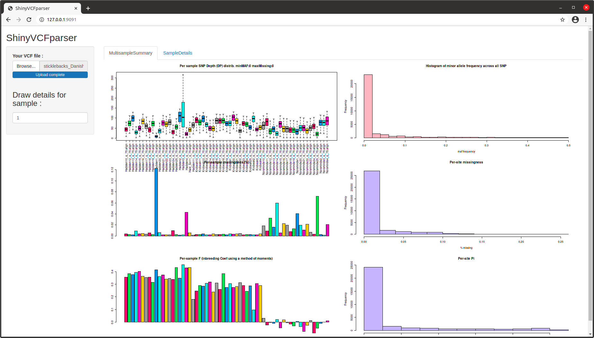
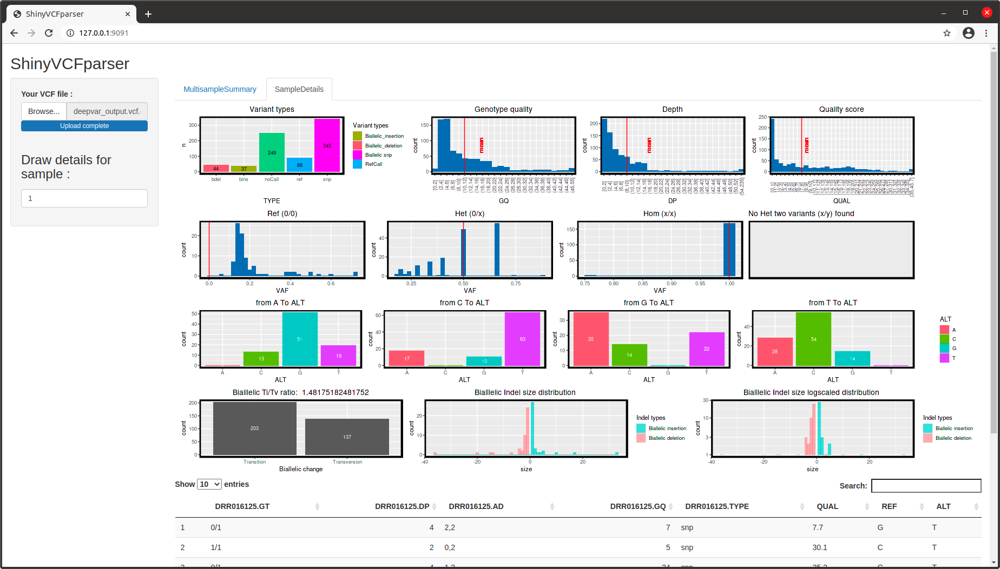

This application summarize VCF files visualy. 

First, commands are used to extract multisamples infos and generate their correponding plots.


If desired one can get more details about selected sample in a separate tab.

Detailed statistics are mostly inspired by deepvariant VCF stats report : https://github.com/google/deepvariant/blob/r0.10/docs/deepvariant-vcf-stats-report.md.



First the VCF file is parsed to extract various informations (GT, DP, GQ, ...) that are then ploted.

Freebayes users have to use --genotype-qualities option to get the GQ values.

Bcftools mpileup must be run  at least with the option -a AD,DP

This tool can be used either via a command line with the 2 scripts (parseMultiSamplesVCF.sh and Draw_fonction_MultiSamples.R) or via a provided shiny application.

Installation :

Needed packages and other dependencies :
 
R must be installed on your linux (test have been made on R version 4.0.3)
 
Rscript -e "install.packages(c('shiny','shinydashboard','shinyjs','DT','ggplot2','tidyverse','patchwork','shinycssloaders','shinyFiles','vroom'), Ncpus = 8)"
  
sudo apt-get install gawk

Source code:
  
git clone https://github.com/BELKHIR/vcfmultisampleparser.git
  
cd vcfmultisampleparser

# Running the shiny app :

Rscript -e 'shiny::runApp(".", host="127.0.0.1", port=4123)'

Open your browser and go to this URL : http://127.0.0.1:4123

# In command line mode :

Starting with a vcf file in 3 steps :

An example of vcf file sticklebacks_Danish_HAD-KRO-NOR.vcf.gz file can be found in examples directory. This is a subset of data extracted from the Dryad dataset : https://doi.org/10.5061/dryad.kp11q of Ferchaud et al. 2015.

* Create a pre-processed file from vcf file (optionnaly gziped)
 
   ```bash ./parseMultiSamplesVCF.sh examples/sticklebacks_Danish_HAD-KRO-NOR.vcf.gz myfile.processed.tsv```

* Generate multi samples summary plots in a file named myfileFig.png

  ```Rscript myfile.processed.tsv myfileFig```

* Generate detailed plots for each sample 

    ```fic="myfile.processed.tsv" # pre-processed file name```

    ```sample=1 # position of the sample to analyse. Here the first one```

    ```fig="sample"${sample}".png" # fig output filename```

    ```Rscript -e "source('./Draw_fonction_MultiSamples.R');  png(file='$fig', width = 1200, height = 1000); Draw('$fic', $sample, NULL); dev.off()"```


vcfmultisampleparser is GPLv3 software, authored and maintained by Khalid Belkhir